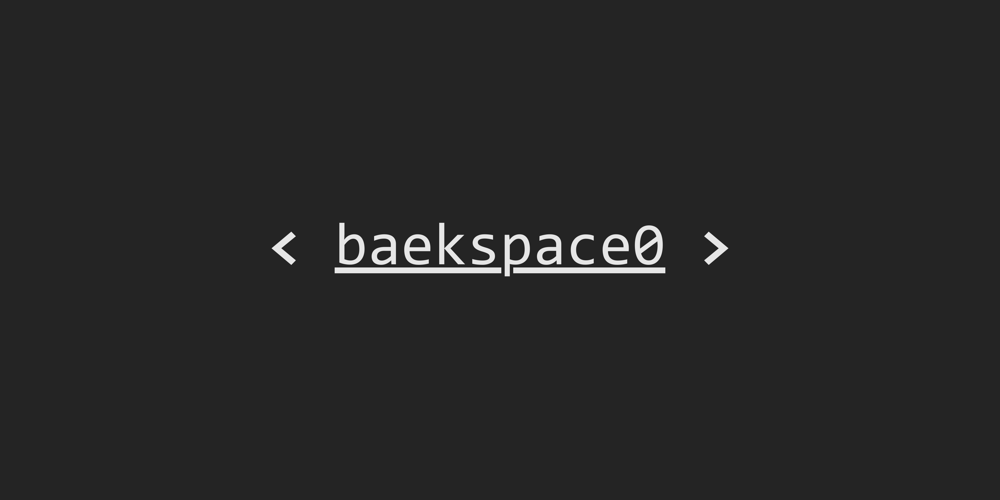

  

# 👋 Hi, I'm Ji Baek Lee — `baekspace0`

I build ideas into reality through code,  
navigating the space between imagination and execution.

## 🪐 About Me
I'm a developer who believes in clarity, precision, and purpose.  
Much like the cosmos, I value systems that are both **elegant and expansive**.  
My mission is to design software that's not only functional, but meaningful.

## 🔧 Tech Stack
- **Languages**: Java, Kotlin, Python, C  
- **Tools**: Git, Docker, IntelliJ IDEA, VSCode  
- **Interests**: Backend Architecture, AI Engineering, Systems Thinking

## 🚀 Projects
I’m currently working on:
- 🧠 AI-assisted code review systems
- 📱 Productivity platforms for university communities
- 🛰️ Discord bots & Minecraft plugin automation

## 📫 Contact
- Email: your.email@example.com  
- LinkedIn: [linkedin.com/in/yourprofile](https://linkedin.com/in/yourprofile) *(optional)*  
- Blog: [yourblog.com](https://yourblog.com) *(optional)*

---

> _"Code is my vessel. Space is my perspective."_  
> — **baekspace0**
